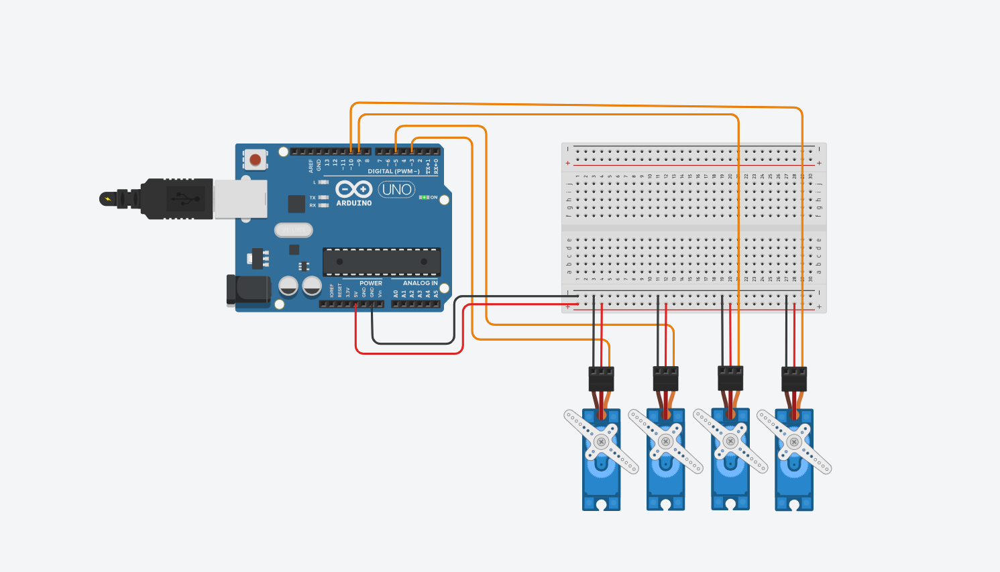

# arduino-servo-sweep

A simple interactive Arduino UNO project to control 4 servo motors (SG90) simultaneously.  
Each servo is connected to a digital pin and moves in sync from 0° to 180° and back in a smooth motion.

---

## Project Preview

Below is a screenshot of the full servo wiring setup in Tinkercad:



---

## Try It Yourself

You can try the full simulation here:  
 [Start Simulation](https://www.tinkercad.com/things/9ysM454EFyN-incredible-gaaris-kasi)

Click **"Start Simulation"** to watch how the servos sweep back and forth using the Arduino logic.

---

## Components Used

- 1x Arduino UNO  
- 4x SG90 Servo Motors  
- 1x Breadboard  
- Several Jumper Wires  
- (No external power supply was used)

---

## Arduino Code Example

This example shows how to control 4 servos in synchronized motion using the `Servo.h` library:

```cpp
#include <Servo.h>

Servo servo1, servo2, servo3, servo4;

void setup() {
  servo1.attach(3);
  servo2.attach(5);
  servo3.attach(9);
  servo4.attach(10);
}

void loop() {
  for (int i = 0; i <= 180; i += 10) {
    servo1.write(i);
    servo2.write(i);
    servo3.write(i);
    servo4.write(i);
    delay(100);
  }

  for (int i = 180; i >= 0; i -= 10) {
    servo1.write(i);
    servo2.write(i);
    servo3.write(i);
    servo4.write(i);
    delay(100);
  }
```
---

## Wiring Summary

| Servo | Signal Pin | VCC (Red)         | GND (Brown/Black) |
|-------|------------|-------------------|-------------------|
| 1     | D3         | 5V (from Arduino) | GND               |
| 2     | D5         | 5V (from Arduino) | GND               |
| 3     | D9         | 5V (from Arduino) | GND               |
| 4     | D10        | 5V (from Arduino) | GND               |

> Powered entirely from Arduino's 5V pin — no external supply used.  
> Circuit tested successfully in simulation.
